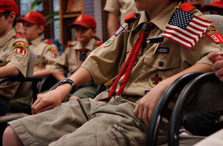

Membership in Troop 924 is open to all youths between the ages of 11 and 18, or to those who are 10½ years old and have completed fifth grade. Webelos completing the Arrow of Light may join the Troop immediately, regardless of age or grade in school.

## Visiting first

Youths who meet these requirements may visit up to three Troop meetings. During this time, a youth may take part in Troop activities only if an application to join Troop 924, signed by a parent or guardian, is on file with the Troop. (BSA accident insurance covers only registered Scouts.) The application isn't sent to the Council for registration until the youth decides to join Troop 924. Dues are due at that time, and the Scout is issued a neckerchief and Scout Handbook.

The [Youth Application](https://filestore.scouting.org/filestore/pdf/524-406.pdf) and other paperwork are on the [Forms](/forms/) page.

## Parents join too

As soon as a youth becomes a member, so do their parents or guardians. Personal involvement of a youth's parents in Troop activities is expected. Over the years we've noticed a strong connection between how involved parents are and how much their child gets out of Scouting. See [For families](/families/) for more on adult involvement.

## Your first year

New members are placed in a patrol with older Scouts, who serve as Troop guides. This is designed to advance them to First Class during their first year of membership.

The Scoutmaster or the Scoutmaster's representative will meet with the parents of new Scouts to discuss how the Troop operates and why the parents' commitment matters to each Scout's success.
